# 🛡️ AegisTrail

**An AI-assisted SOAR pipeline for AWS identity threats — detect → enrich → triage → human-approve → contain.**

AegisTrail is an open-source, event-driven security-automation platform. It ingests AWS
CloudTrail activity, runs custom detections, enriches with GeoIP + threat intelligence,
scores each incident, uses an LLM to triage it in plain English, and then routes high-risk
incidents to a human for a one-click **approve-and-contain** decision — with a full audit
trail and a safety model that prevents the tool from harming the account it protects.

> **Design principle:** human-in-the-loop SOAR with AI triage — *not* "autonomous containment."
> Every destructive action is gated behind a human approval and a deterministic allowlist.
> Some scenarios deliberately do **not** auto-contain — knowing when *not* to automate is the point.

---

## Why this exists

Identity is the #1 cloud attack surface (leaked keys, privilege escalation, anomalous logins).
This project demonstrates the full blue-team loop end to end:

- **Detection engineering** — custom CloudTrail detections + signal correlation, not just a managed service
- **Security automation (SOAR)** — orchestrated in n8n, the open-source cousin of Tines / Splunk SOAR / Cortex XSOAR
- **AI-assisted triage** — an LLM summarizes and recommends, hardened against prompt injection, with a rules-only fallback
- **Secure-by-design** — the tool is threat-modeled as the high-value target it is

## Architecture

```mermaid
flowchart LR
    CT["CloudTrail / GuardDuty<br/>finding"] --> WH["n8n Webhook"]
    WH --> ING["/ingest<br/>normalize + store"]
    ING --> SC["/score"]

    subgraph DET["Detector service · FastAPI + Postgres"]
        SC --> EN["Enrich<br/>GeoIP + AbuseIPDB"]
        EN --> RU["Rules engine<br/>NEW_REGION · PRIV_ESC · TI_*"]
        RU --> RS["Risk score 0–100<br/>+ incident"]
        RS --> AI["AI triage<br/>OpenAI gpt-4o-mini"]
    end

    AI --> GATE{"risk ≥ 50?"}
    GATE -- "no" --> CLOSE["Auto-close + log"]
    GATE -- "yes" --> SLACK["Slack alert<br/>Approve / Dismiss"]
    SLACK --> WAIT["Wait for human"]
    WAIT -- "Approve" --> CONTAIN["/contain<br/>SAFE_MODE plan"]
    WAIT -- "Dismiss" --> FP["resolve<br/>FALSE_POSITIVE"]
    CONTAIN --> RES["resolve<br/>CONTAINED"]
    RES --> AUD[("Audit trail<br/>incidents")]
    FP --> AUD
```



- **n8n** owns orchestration: webhook, routing, the human-approval gate, and Slack delivery.
- **Detector** (`detector/`, FastAPI + Postgres) owns the stateful logic: per-identity baselines,
  detection rules, risk scoring, correlation, AI triage, and the incident lifecycle.

## Detection scenarios

| # | Scenario | Signals | Containment |
|---|----------|---------|-------------|
| 1 | **Leaked key, new geo/IP** ✅ | `NEW_REGION`, `TI_HOSTING` | deactivate access key (on approval) |
| 2 | **IAM privilege escalation** ✅ | `PRIV_ESC_CHAIN` (+ `NEW_REGION`) → `CREDENTIAL_COMPROMISE` | detach policy / deactivate key |
| 3 | Recon / enumeration 🚧 | burst of `List*`/`Describe*` | alert-only by default |
| 4 | Root usage / MFA disabled 🚧 | root principal / `DeactivateMFADevice` | escalate to human (no auto-disable) |

Scenarios #1 and #2 are fully implemented (detect → triage → contain). #3 and #4 are scoped as
detect-and-alert only — consistent with the "don't auto-contain everything" design.

**Hybrid detection:** custom CloudTrail/EventBridge rules *and* GuardDuty findings feed the same pipeline.

## How scoring works

Deterministic rules produce signals; each signal has a base score; the LLM then *annotates* the result.

| Signal | Base | Meaning |
|--------|------|---------|
| `NEW_REGION` | 20 | source-IP country outside the identity's baseline |
| `TI_HOSTING` | 15 | source IP is datacenter/hosting (suspicious for a human identity) |
| `TI_ABUSE` | 40 | source IP flagged by AbuseIPDB |
| `PRIV_ESC_CHAIN` | 60 | sensitive IAM mutation (`AttachUserPolicy`, `CreateAccessKey`, …) |

Correlated signals raise the incident type (e.g. `NEW_REGION` + `PRIV_ESC_CHAIN` → `CREDENTIAL_COMPROMISE`).
The **LLM never sets the score or triggers actions** — it writes the summary and recommends an action from a
fixed enum, behind the human gate.

## Quickstart

Prereq: **Docker Desktop**.

```bash
cp .env.example .env      # add OPENAI_API_KEY, SLACK_WEBHOOK_URL, ABUSEIPDB_API_KEY (Windows: copy)
docker compose up -d --build
```

| Service | URL | Purpose |
|---------|-----|---------|
| n8n | http://localhost:5678 | SOAR orchestration (import a workflow from `n8n/workflows/`) |
| detector | http://localhost:8000/docs | FastAPI — `/ingest`, `/score`, `/contain`, `/incident/resolve` |
| postgres | localhost:5432 | detector state + audit trail |

> ⚠️ Use `docker compose down` to stop. **Never `down -v`** — that wipes the n8n volume (account + workflows).
> For a clean DB, drop only `aegistrail_pgdata`.

## Demo (no AWS account needed)

The detector compares a finding's source-IP geo against a seeded "normal" baseline.

```bash
# 1) seed dev-bot's normal location (United States)
curl -X POST http://localhost:8000/baseline/seed -H 'Content-Type: application/json' \
  -d '{"identity":"dev-bot","known_countries":["United States"],"known_regions":["us-east-1"],"event_count":5}'

# 2) in n8n: import n8n/workflows/aegistrail-phase3.json, then Webhook node -> "Listen for test event"

# 3) fire a privilege-escalation-from-Russia finding at the webhook
./scripts/post_sample.ps1 -SampleFile samples/privesc_finding.json
```

You'll get a Slack alert (risk **95/100**, `CREDENTIAL_COMPROMISE`, AI summary, `escalate_to_human`) with
**Approve / Dismiss** links. Clicking **Approve** runs the SAFE_MODE containment plan and marks the incident
`CONTAINED`. Re-seed between runs — the detector *learns* each geo it sees.

## Security model (the tool is threat-modeled as a target)

A security tool with broad IAM power is itself a high-value target. AegisTrail is hardened accordingly:

- **No self-lockout** — a protected-identity allowlist (root, break-glass, the automation's own role) is
  enforced *before* any containment. The tool cannot disable the account it protects.
- **SAFE_MODE** — containment returns the boto3/CLI **action plan** and executes nothing by default.
- **Prompt-injection resistant triage** — finding data is passed to the LLM as untrusted input; the model is
  told to treat it as data, its output is validated against a fixed enum, and it never triggers actions.
- **LLM is not a single point of failure** — missing key or failed call degrades to rules-only.
- **Least privilege + secrets hygiene** — scoped containment creds, secrets only in gitignored `.env`,
  pre-commit secret scanning, no credentials in committed workflows (Slack URL comes from the environment).

## Project layout

```
detector/        FastAPI detector: normalize, baseline, scoring, detect, triage, contain
db/init.sql      Postgres schema (events, identity_baseline, incidents, incident_events)
n8n/workflows/   importable workflows (phase1 = alert, phase2 = triage+route, phase3 = +containment)
samples/         sample findings (leaked key, privilege escalation)
scripts/         post a sample finding to the webhook
docs/            cloud-portability mapping (AWS → Azure/GCP)
```

## Tech stack

n8n · FastAPI · PostgreSQL · Docker Compose · OpenAI (`gpt-4o-mini`) · AbuseIPDB · ip-api (GeoIP) · boto3

Built on AWS, **designed cloud-portable** — see [docs/azure-entra-mapping.md](docs/azure-entra-mapping.md).

## Roadmap

- Rollback / undo for a containment (false-positive recovery)
- Scenarios #3 (recon) and #4 (root/MFA) as detections
- Detection-as-code tests (`stratus-red-team` as a test suite)
- Terraform for the AWS lab + a metrics dashboard (MTTR before/after)

## License

[MIT](LICENSE) © 2026 Mouli Kesavan
